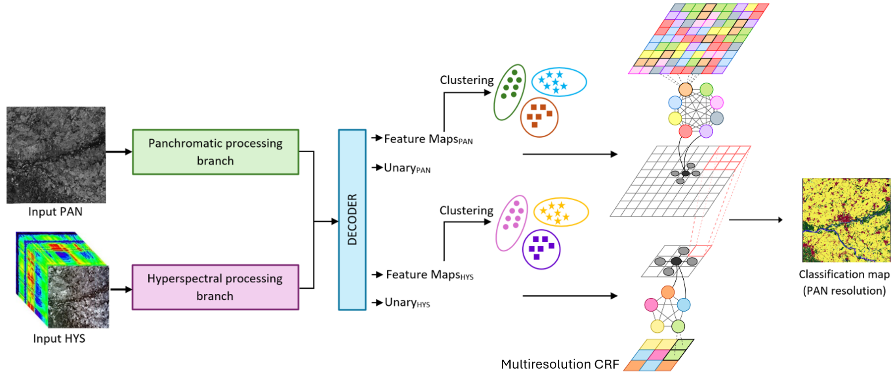

# CFC-MCRF

This repository contains the code related to the TGRS'26 paper:


M. Pastorino, G. Moser, S. B. Serpico and J. Zerubia, "Cross-Modal Fusion and Classification of Hyperspectral and Panchromatic Remote Sensing Images with Deep Learning and Multiscale CRFs," in IEEE Transactions on Geoscience and Remote Sensing, doi: 10.1109/TGRS.2026.3686949.




The private imagery, clusters, activations, checkpoints, and `.mat` files are **not** included in the repository. Follow the folder layout below to rebuild the project locally.

## 🥚 Project structure

```CFC-MCRF/
│
├── dataset.py
├── utils.py
├── net/
│   ├── net.py
│   ├── crossmodal_net.py
│   ├── loss.py  
├── utils/
│   ├── utils.py
│   ├── utils_dataset.py
│   ├── utils_network.py
├── train.py
├── extract.py
│
├── MultiresCRF/
│   ├── CFC-CRF_Model_Source/   # <- contains the functions building the multiresolution CRF 
│   ├── Utils/                  # <- contains additional helper functions
│   ├── gcmex-2.3.0/            # <- contains the grah-cut functions in C++ and the matlab wrapper
│   ├── multires_CFCCRF.m
│   ├── Assemb_Img_RemBord_Indexes.m
│   └── utils_debug.m
│
├── PRISMA_Tensors/dataset/        # <- outputs of neural nets go here (.mat)
├── PRISMA_Clusters/dataset/       # <- outputs (clusters) from utils_debug.m go here (.mat)
├── data/dataset/                  # <- raw data (not uploaded)
│
├── main.py
├── requirements.txt
└── README.md
```

## 🐣 Data layout

Place each PRISMA tile in its own folder under `data/dataset/`. Example:

```text
data/
└── dataset/
    ├── 001_Cube.tif                 # <- high-resolution PAN input
    ├── 001_VNIR_SWIR.tif            # <- coarse-resolution hyperspectral VNIR+SWIR input
    └── 001_gt_CRS_registered.tif    # <- registered ground-truth labels
```

## 🐤 Installation

Create an environment and install dependencies:

```bash
pip install -r requirements.txt
```

## 🐔 Run the neural (Python) models and extract activations / posteriors for MATLAB

```bash
python main.py 
```

The script will automatically:

1. build the PRISMA dataset,
2. train the selected neural model (ViT or CNN),
3. save the checkpoint in `checkpoints/`,
4. extract activations and posteriors,
5. save MATLAB-compatible .mat tensors in `PRISMA_Tensors/`.

Example output files:

```
PRISMA_Tensors/<dataset>_<CNN_model>_post6_PAN.mat
PRISMA_Tensors/<dataset>_<CNN_model>_post6_HYS.mat
PRISMA_Tensors/<dataset>_<CNN_model>_act_8_PAN.mat
PRISMA_Tensors/<dataset>_<CNN_model>_act_8_HYS.mat
```

## 🪺 Multiresolution CRF (matlab)

The MATLAB part is separated from the Python neural models. Run it after the neural scripts have produced the activation/posterior `.mat` files.

### Execution order

1. **`MultiresCRF/utils_debug.m`**

   This is the MATLAB setup script. It creates the variables and configuration structures required by the fusion routine:

   - loads fine-resolution PAN activations and posteriors
   - loads coarse-resolution HYS activations and posteriors
   - loads the fine and coarse ground truth maps
   - builds `posteriors`, `imageTensor`, `Patch_division`, and `Param` suitable for matlab execution
   - computes the fine/coarse cluster structures `Cluster_Data.f` and `Cluster_Data.c`
   - saves the generated cluster data for later reuse

2. **`MultiresCRF/multires_CFCCRF.m`**

   This is the multiresolution CFC-CRF execution script. It expects the variables prepared by `utils_debug.m` to already exist in the MATLAB workspace. It then:
   - splits the fine and coarse images into corresponding patches
   - extracts activations, posteriors, and ground truth for each patch
   - builds the fine-resolution and coarse-resolution CRF graphs
   - adds cluster-level connections at both resolutions
   - combines the fine/coarse energies into a multiresolution graph
   - runs graph cut with `GCMex`
   - saves patch-level results and elapsed times when `Param.Save.save_data = true`


3. **`MultiresCRF/Assemb_Img_RemBord_Indexes.m`**

   Creates the final labeled image starting from the patches computed in the previous step, and transforms it in a RGB image (following a colorpalette defined in `MultiresCRF\Utils\Assign_Color_to_Class.m`

### Expected MATLAB data layout

Large MATLAB files should not be committed to GitHub. Users should create the folders below locally and place their private files there.

```PRISMA_Tensors/
└── <dataset>/
    ├── gt.mat
    ├── gt_c.mat
    └── <CNN_model>/
        ├── <dataset>_<CNN_model>_act_8_PAN.mat
        ├── <dataset>_<CNN_model>_act_8_HYS.mat
        ├── <dataset>_<CNN_model>_post6_PAN.mat
        └── <dataset>_<CNN_model>_post6_HYS.mat

PRISMA_Clusters/
└── <dataset>/
    └── <CNN_model>/
        └── Clusters_img_<dataset>_<CNN_model>_<nFine>clF_<nCoarse>clC.mat

res/
└── <dataset>/
    └── <CNN_model>/
        └── ... saved MATLAB fusion outputs ...
```

## 🍳 License

The code is released under the GPL-3.0-only license. See LICENSE.md for more details.

## 🍽️ Acknowledgements

This work was conducted at [INRIA](https://team.inria.fr/ayana/team-members/), d'Université Côte d'Azur and at the [University of Genoa](http://phd-stiet.diten.unige.it/), partially supported by the Italian Space Agency (ASI) within the Framework of the Project under Grant PRISMA-Learn-ASI no. 2022-12-U.0. 
